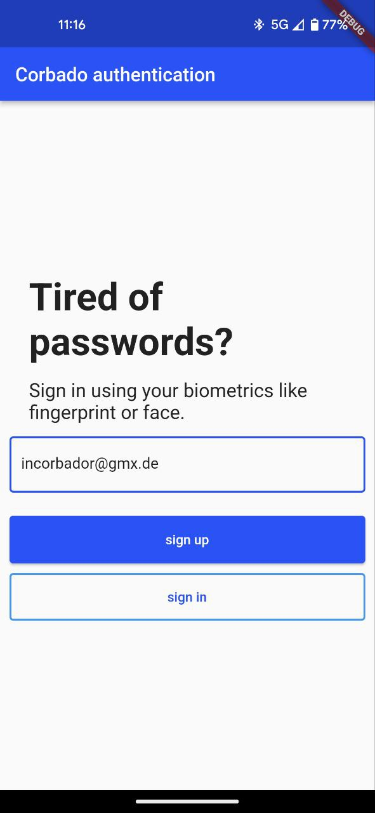
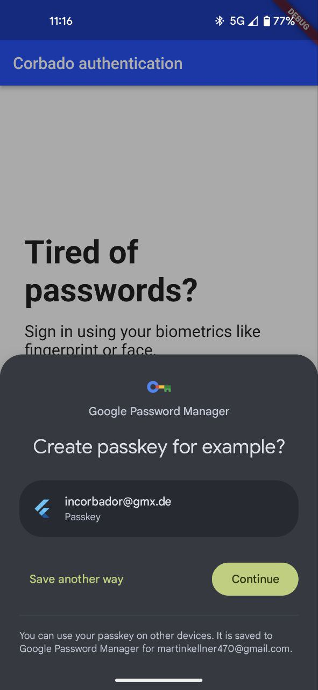
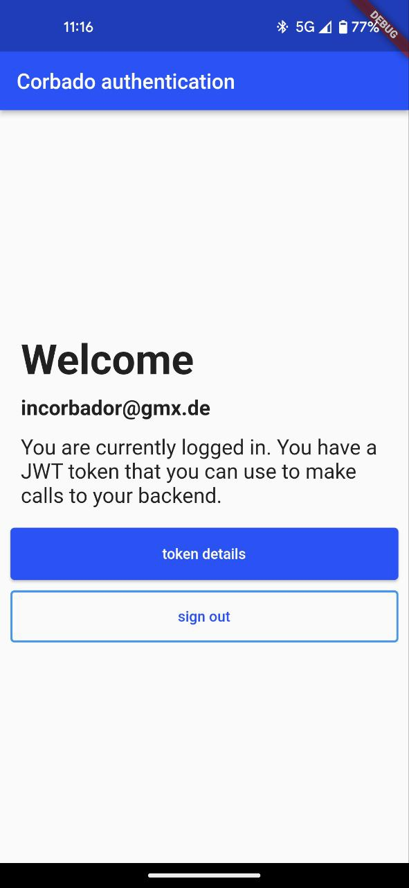
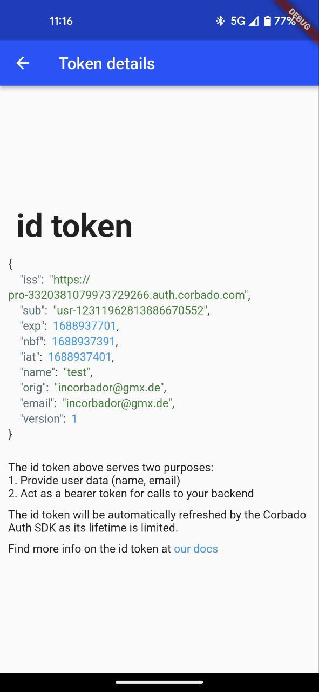

# Corbado Auth for Flutter

## Getting started

A Flutter package to enable authentication through passkeys.
Setting up passkey authentication requires you to have a backend that can act as a relying party.
As this is quite a bit of work the Corbado team is at your service.
You can set up your relying party server just by creating and configuring your free Corbado project.
The Corbado Auth package helps you to integrate your app after you have set up your Corbado project.

This package offers the following functionalities:

- keeping a user logged in even if he closes the app
- continuously updating a user's tokens (by default their lifetime is limited to 5 minutes)

**Note:** For an explanation on passkeys and the information flows between client, authenticator and
relying party, take a look at the [passkeys package](https://pub.dev/packages/passkeys).

## Configuration to start the example project

These steps are required to run the example but you also need to follow them to create your own app.

### iOS

#### 1. Create an iOS app and configure the example in XCode

We need to establish trust between your iOS app and the relying party server.
Your app will be identified through your **App ID Prefix** (e.g. `9RF9KY77B2`) and your **Bundle ID** (e.g. `com.corbado.passkeys`).
You need an Apple developer account to setup both.
If you haven't got one yet, set up a new account.

**Note:** When creating your Bundle ID make sure that the "Associated Domains" capability is enabled.

Open the example in Xcode now by opening `packages/passkeys/passkeys/example/ios`.
In *Runner* -> *Signing & Capabilites* enter your *App ID Prefix* and your *Bundle ID*.

#### 2. Set up Corbado project

Create a free Corbado project at the [Corbado developer panel](https://app.corbado.com/signin#register) if you haven't got one yet.
It will act as your relying party server.

There will be a quick setup procedure. Follow it and make sure to select 'Native app'.

#### 3. Set up an iOS app in Corbado

Make sure that under *Settings* -> *User interface* -> *Identity verification* "Option 2: No verification required" is selected (https://app.corbado.com/app/settings/userinterface).

Setup an iOS app at https://app.corbado.com/app/settings/credentials/native-apps by clicking "Add New".
You will need your **App ID Prefix** and your **Bundle ID** that we set up in step 1.

After you did that your relying party server will host an apple-app-site-association file (the url looks like this: https://{PROJECT_ID}}.frontendapi.corbado.io/.well-known/apple-app-site-association).
This file will by downloaded by iOS when you install your app.
To tell iOS where to look for the file we need the next step in our set up.

#### 4. Configure your iOS project

In your Xcode workspace, you need to configure the following settings:
In `Signing & Capabilities` tab, add the `Associated Domains` capability and add the following domain: `webcredentials:{PROJECT_ID}.frontendapi.corbado.io`
Now iOS knows where to download the apple-app-site-association file from.

If you forget about this step the example will show you an error message like `Your app is not associated with your relying party server. You have to add...`.
Your configuration inside Xcode should look like something like in the screenshot below (you will have your own projectId and a different bundle identifier).

#### 5. Start the example

`flutter run --dart-define=CORBADO_PROJECT_ID=PROJECT_ID lib/main.dart`

If you want to run the example from your IDE please make sure to either
- set the CORBADO_PROJECT_ID environment variable to your Corbado projectID
- replace `const String.fromEnvironment('CORBADO_PROJECT_ID')` directly in the example with your Corbado projectID

### Android

#### 1. Set up Corbado project

Create a free Corbado project at the [Corbado developer panel](https://app.corbado.com/signin#register) if you haven't got one yet.
It will act as your relying party server.

There will be a quick setup procedure. Follow it and make sure to select 'Native app'.

After creating the project you will get a projectId (e.g. `pro-4268394291597054564`).
You will need it in the next steps.

#### 2. Start the example

`flutter run --dart-define=CORBADO_PROJECT_ID=PROJECT_ID lib/main.dart`

#### 3. Set up an Android app in Corbado

Setup an Android app at *https://app.corbado.com/app/settings/credentials/native-apps* by clicking "Add new".
You will need your **Package name** (e.g. `com.corbado.corbadoauth.example`) and your **App fingerprint** (e.g. `54:4C:94:2C:E9:...`).

The package name of your app is defined in *example/android/app/build.gradle* (applicationId).
It's default value for the example app is `com.corbado.corbadoauth.example`.

The easiest way to find your app fingerprint is to look into the logs of the example app.
You will find a log message like `Fingerprint: 54:4C:94:2C:E9:...`.
Copy the full fingerprint and use it to setup the Android app in Corbado.

Finally, you have to whitelist your app for the Corbado API.
To do this, go to *https://app.corbado.com/app/settings/credentials* (authorized origins) and click "Add new".
For the *Name* field you can choose any value you like.
For the *Origin* field provide `android:apk-key-hash:<base64-encoded-app-fingerprint>` (e.g. `android:apk-key-hash:VEyULOkvasF9VsJd29ZecTKkDWJ-PvLkCagYn9BjqPs`).
The value for your app can also be found in the log messages of the example (`setting Origin of API requests to android:apk-key-hash:VEy...`).

Now you are fully set and you can start registering your first passkey in the example.

## A closer look at the example

After following the configuration steps above you can run the app.
The first screen you will see is the login page.
Here, you can create a new user account by providing an email address and clicking on 'sign up'.
After providing your fingerprint / face scan, a new passkey is created and stored on your device.

You will now be logged into the app and see the home page.
Your user info is represented by an id token that has been retrieved from the Corbado API during the sign up process.
You can view that token by clicking on "token details".
Here, you can observe how the token is refreshed automatically (its lifetime will increase once in a while).

You can also close and reopen the app.
You should still be logged in.

