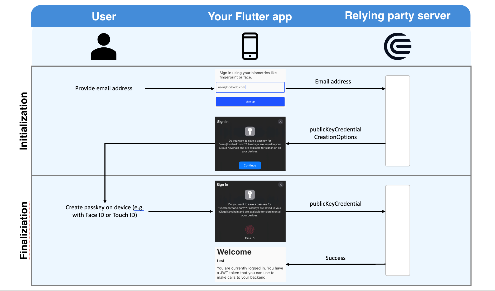

# passkeys

A Flutter plugin to enable authentication through passkeys.

|             | Android | iOS | Linux | macOS | Web | Windows |
|-------------|---------|-----|-------|-------|-----|---------|
| **Support** | yes     | yes | no    | no    | no  | no      |

## Usage

To use this plugin, add `passkeys` as a [dependency in your pubspec.yaml file](https://flutter.dev/platform-plugins/).
The best way to learn how you can set up passkeys in your app is to read the brief introduction below
and then take a look at the example of this package.
For a more elaborated example, you can also take a look at the corbado_auth package.

## Introduction to passkeys

When it comes to understanding passkeys, there are three parties:
- the user of your app
- your Flutter app (installed on a device with Face ID or Touch ID)
- a relying party server (a backend where user public keys will be stored)

Like with traditional password based authentication flows a user has to register first, i.e. set up a passkey.
The flow is shown in the image above.

At first the user will provide his email address to your app.
This email address will be sent to the relying party server.
You can implement that server yourself, or you can rely on prebuilt ones (e.g. Corbado).
The relying party server's response will contain *publicKeyCredentialCreationOptions*.
It contains all information required by the user's device to set up a passkey.

Your app will now interact with our native device's OS (no worries, the actual work is abstracted by this Flutter package) to ask the user to set up a passkey.
All he has to do is to provide his biometrics once (Face ID or Touch ID).
After this setup a private key and a public key are created. 
The private key is stored securely on the user's device.
The public key is sent to the relying party server. 
For this to work, the app has to be associated with the relying party server. 
This involves a bit of configuration in your app and on the relying party server (find more details below where we explain how to set up the example). 
The relying party server will validate and store the private key.
Afterwards, it will respond with a success message (e.g. a JWT token). 

From now on, the user can sign in to your app using this biometric information.
On each sign in, your app will ask the relying party server for a *challenge*.
The relying party server generates this challenge using the public key that was stored during the register flow.
Therefore, this task can only be solved by someone who has access to the private key.
To solve the challenge the app asks once again the user for his biometrics (another call to your native device's OS).
After the user has provided his biometrics (e.g. by putting his finger on the fingerprint reader), the challenge is signed and the signed challenge is sent to the relying party server.
If the signed challenge is correct, the server will answer with a success message (e.g. a JWT token).

While this is a more convenient and safe way for users to sign in to your app, there are two main problems to solve:
- to create the passkey during registration and to sign the challenge during sign in, the app has to interact with the platform (e.g. iOS or Android) => this problem is solved by this Flutter package
- you need a relying party server that is able to store public keys securely and create challenges => this problem is solved by services like [Corbado](https://corbado.com)

## Use cases of this package

The _passkeys_ package enables you to register and sign in users with passkeys.
It is not a full authentication SDK though.
An authentication SDK additionally supports you with functionalities like:

- keeping a user logged in even if he closes the app
- continuously updating a user's tokens (usually their lifetime is limited), e.g. by using refreshTokens
- helping you to integrate your app with a backend (e.g. Firebase or a custom backend)

Keeping this in mind helps us to understand the following use cases:

### Use case 1: You just want to prototype with passkeys

In this case, you can directly use this package.
Just set up the example and run it on your device.
If you like the experience with passkeys you might want to take a look at more advanced use cases afterwards.

### Use case 2: You want to build an app using passkeys for authentication

In this case, you will need the functionalities described previously (e.g. keeping the user logged in even when he closes the app).
You can now either build your own authentication SDK.
When you build it, you can make use of this package.

Alternatively, you can just make use of the _corbado_auth_ package.
It supports all the mentioned functionalities.
Internally, it makes use of this package.
Additionally, it includes an advanced example on how to build an app with passkeys authentication.

### Use case 3: You want to build an app using passkeys for authentication and Firebase as a backend

In this case, you need to deploy a Firebase Extension.
We will open source an implementation for that (including an example) very soon.

## Configuration to set up the example

### iOS

#### 1. Set up Corbado project

Create a free Corbado project at the [Corbado developer panel](https://app.corbado.com/signin#register) if you haven't got one yet.
It will act as your relying party server.

#### 2. Set up an iOS app

Setup an iOS app at https://app.corbado.com/app/settings/credentials/native-apps by clicking "Add New".
You will need your **App ID Prefix** (e.g. `9RF9KY77B2`) and your **Bundle ID** (e.g. `com.corbado.passkeys`).
You can find both settings when you open your project in Xcode under "Signing & Capabilities".
After you did that your relying party server will host an apple-app-site-association file (the url looks like this: https://{PROJECT_ID}}.frontendapi.corbado.io/.well-known/apple-app-site-association).
This file will by downloaded by iOS when you install your app.
To tell iOS where to look for the file we need the next step in our set up.

#### 3. Configure your iOS project

In your Xcode workspace, you need to configure the following settings:
In `Signing & Capabilities` tab, add the `Associated Domains` capability and add the following domain: `applinks:{PROJECT_ID}.frontend.api.corbado.io`
Now iOS knows where to download the apple-app-site-association file from. 

#### 4. Start the example

`flutter run --dart-define=CORBADO_PROJECT_ID=PROJECT_ID lib/main.dart`

### Android

#### 1. Set up Corbado project

Create a free Corbado project at the [Corbado developer panel](https://app.corbado.com/signin#register) if you haven't got one yet.

#### 2. Set up an Android app

Setup an Android app at https://app.corbado.com/app/settings/credentials/native-apps by clicking "Add New".
You will need your **Package name** (e.g. `com.corbado.passkeys`) and your **App fingerprint** (e.g. `54:4C:94:2C:E9:...`).

#### 3. Start the example

`flutter run --dart-define=CORBADO_PROJECT_ID=PROJECT_ID lib/main.dart`
